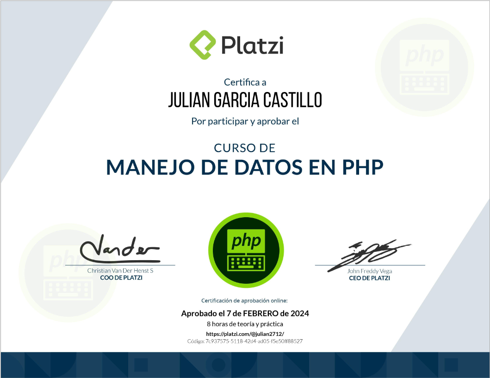

## Ruta PHP
### Curso 6

# Descripción
Entender los tipos y estructuras de datos esenciales en un lenguaje de programación es lo que te permite pasar a un nivel avanzado. En este curso conocerás las principales de PHP, sus características y sacarles el mejor provecho para que tus desarrollos tengan una calidad profesional.